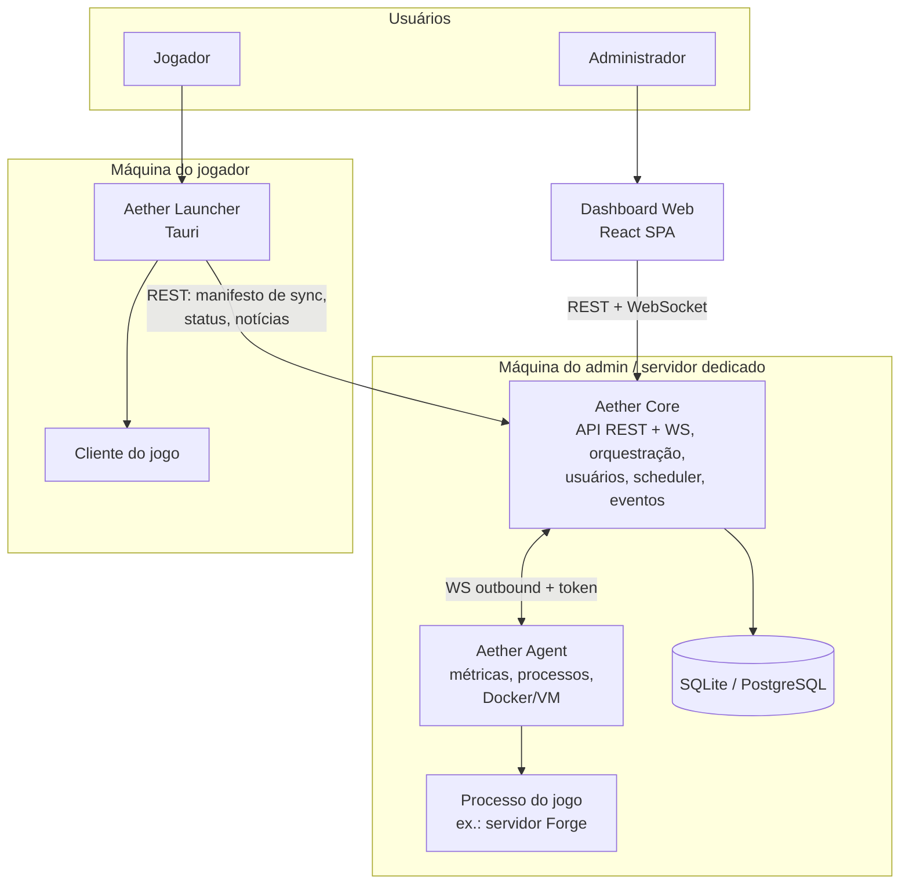

# 02 — Arquitetura

## Visão geral (C4 — nível de contêineres)



Quatro executáveis, um cérebro:

| Contêiner | Papel | Conhece jogos? |
|---|---|---|
| **Core** | API, autenticação, orquestração, eventos, scheduler, plugins | ❌ (só via Providers carregados) |
| **Agent** | Braço na máquina do servidor: processos, métricas, Docker | ❌ (executa comandos que o Core manda) |
| **Dashboard** | SPA web, cliente da API | ❌ (renderiza schemas que os Providers declaram) |
| **Launcher** | App desktop do jogador, cliente da API pública | ❌ (plugins de Provider no launcher) |

No modo mais comum (tudo na mesma máquina), Core e Agent rodam juntos no mesmo processo (**Agent embutido**) — instalação de um clique. O Agent remoto separado é o mesmo código com transporte WS.

## Camadas internas do Core (Clean Architecture)

```
interfaces  →  application  →  domain  ←  infrastructure
(FastAPI       (casos de uso,   (entidades,    (SQL, filesystem,
 REST/WS)       serviços,        regras puras,  processos, WS,
                portas)          eventos)       providers loader)
```

Regras de dependência:
- `domain` não importa nada de fora (nem FastAPI, nem SQLAlchemy).
- `application` define **portas** (interfaces abstratas); `infrastructure` as implementa.
- `interfaces` (rotas HTTP/WS) só chama casos de uso; nunca toca banco ou filesystem.
- Troca de banco, de framework web ou de transporte não toca `domain`/`application`.

## Modelo de domínio (entidades centrais, agnósticas de jogo)

| Entidade | Significado |
|---|---|
| **Node** | Uma máquina gerenciada (onde um Agent roda). O "local" é um Node implícito. |
| **Instance** | Uma instância de servidor de jogo em um Node (ex.: "Servidor Forge 1.20.1"). Tem Provider, diretório, estado, config. |
| **Provider** | Adaptador de jogo registrado (ex.: `minecraft`). Instances referenciam por id. |
| **ContentItem** | Item de conteúdo de uma Instance (mod, plugin, mundo, resource pack…) — tipos declarados pelo Provider. |
| **SyncProfile** | Manifesto do que o cliente do jogador deve ter (arquivos + SHA256 + regras) publicado por uma Instance. |
| **User / Role / Permission** | RBAC. Permissões granulares por Instance. |
| **Task / Schedule** | Trabalho agendado (backup, restart, script). |
| **Backup** | Snapshot de uma Instance com retenção. |
| **Event / AuditLog** | Tudo que acontece vira evento (barramento interno); ações de usuário viram auditoria. |

## O contrato de Provider (o coração da extensibilidade)

Um Provider é um pacote Python que implementa interfaces do SDK e declara um manifesto. O Core descobre Providers via entry points (`aether.providers`) — instalar um Provider é `pip install aether-provider-<jogo>`.

Contrato conceitual (assinaturas ilustrativas — o código real nasce na v0.1):

```python
class GameProvider(Protocol):
    manifest: ProviderManifest          # id, nome, versão, jogos/sabores suportados

    # Ciclo de vida
    def flavors(self) -> list[Flavor]                    # ex.: vanilla, forge, paper, velocity
    def installer(self, flavor) -> Installer             # baixa/instala o servidor
    def launch_spec(self, instance) -> LaunchSpec        # comando, env, workdir, portas
    def console_codec(self) -> ConsoleCodec              # parse de log → eventos; envio de comandos
    def health(self, instance) -> HealthProbe            # como saber se está online (query, RCON…)

    # Conteúdo
    def content_types(self) -> list[ContentType]         # "mod", "plugin", "world", "resourcepack"…
    def content_analyzer(self, ctype) -> ContentAnalyzer # extrai metadados/ícones (ex.: parser de .jar)
    def content_sources(self) -> list[ContentSource]     # Modrinth, CurseForge, Steam Workshop…

    # Configuração & Sync
    def config_schema(self, instance) -> ConfigSchema    # JSON Schema → o Dashboard renderiza forms
    def sync_rules(self, instance) -> SyncRules          # o que entra no manifesto do Launcher

    # Opcional
    def metrics_extractor(self) -> MetricsExtractor | None   # TPS, tick time, jogadores online
    def ai_context(self, instance) -> AIContext | None       # dá contexto de crash/log para o módulo de IA
```

Princípios do contrato:
- **Tudo opcional degrada graciosamente**: um Provider sem `metrics_extractor` simplesmente não mostra o widget de TPS.
- **Schemas, não telas**: Providers declaram `ConfigSchema`/`ContentType` como dados; o Dashboard tem renderizadores genéricos. Um Provider nunca envia HTML.
- **Versionamento do contrato**: o manifesto declara `sdk_version`; o Core rejeita/adapta contratos incompatíveis (mesma estratégia do Terraform com providers).

## Comunicação entre módulos

| Canal | Tecnologia | Uso |
|---|---|---|
| Dashboard ↔ Core | REST (`/api/v1`) + WebSocket (`/ws`) | CRUD, console em tempo real, eventos, métricas |
| Agent → Core | WebSocket **outbound** com token de node | O Agent conecta no Core (atravessa NAT/firewall sem port forward no lado do agent); heartbeat, streams de métricas, execução de comandos |
| Launcher ↔ Core | REST público (somente leitura + auth de jogador) | Manifesto de sync, status do servidor, notícias, perfil |
| Interno (Core) | Barramento de eventos in-process (pub/sub assíncrono) | Desacopla módulos: `instance.started`, `backup.completed`, `content.changed`… Adaptador Redis opcional no futuro para multi-Core |

**Eventos são o sistema nervoso**: plugins, webhooks, notificações mobile e IA assinam o mesmo barramento. Nenhum módulo chama outro diretamente para "avisar" algo.

## Estrutura do monorepo

```
aether/
├─ apps/
│  ├─ core/                 # Python — API + orquestração + Agent embutido
│  │  └─ aether_core/
│  │     ├─ domain/         # entidades, value objects, eventos de domínio
│  │     ├─ application/    # casos de uso, portas (interfaces)
│  │     ├─ infrastructure/ # SQLAlchemy, filesystem, processos, WS, loader de plugins
│  │     └─ interfaces/     # FastAPI (rotas REST + WS), CLI
│  ├─ agent/                # Python — Agent standalone (reusa pacotes do core)
│  ├─ dashboard/            # React + TS + Vite
│  │  └─ src/{app, modules, components, lib}
│  └─ launcher/             # Tauri (Rust shell) + React TS (reusa packages/ui)
├─ packages/
│  ├─ sdk/                  # aether-sdk (Python): contratos de Provider, tipos, testes de contrato
│  ├─ api-client/           # cliente TS gerado do OpenAPI (usado por dashboard e launcher)
│  └─ ui/                   # design system compartilhado (dashboard + launcher)
├─ providers/
│  └─ minecraft/            # aether-provider-minecraft (primeiro Provider)
│     ├─ flavors/           # vanilla, fabric, forge, neoforge, paper, purpur, spigot,
│     │                     # bukkit, velocity, waterfall, bungeecord
│     ├─ content/           # analisador de .jar (portado do GerenciadorDeMods) 
│     ├─ sources/           # Modrinth, CurseForge
│     └─ sync/              # regras de manifesto cliente/servidor
├─ docs/                    # este material + ADRs + site de docs
└─ .github/workflows/       # CI/CD
```

- **Um repositório, releases independentes**: `core`, `launcher`, `agent` e cada provider têm versões próprias (tags `core-v0.3.0`, `launcher-v0.2.1`…).
- `providers/` vive no monorepo por ora; o loader por entry points já os trata como se fossem externos — terceiros poderão publicar providers fora do repo sem mudança no Core (é isso que o SDK garante).

## Dashboard — arquitetura de UI

Referências: VS Code (dock/painéis), Discord (navegação de servidores), Linear (velocidade/atalhos), Raycast (command palette).

- **Shell + módulos**: o shell fornece dock, sidebar, command palette (`Ctrl+K`), sistema de abas e notificações. Cada área (console, arquivos, conteúdo, métricas, config) é um **módulo** com rotas e widgets próprios.
- **Widgets declarativos**: um widget registra `{id, título, fonte de dados (endpoint/canal WS), renderizador}` — base do futuro marketplace de widgets.
- **Renderização por schema**: forms de configuração são gerados do `ConfigSchema` do Provider (JSON Schema + hints de UI).
- Console via **xterm.js**; editor de arquivos/config via **Monaco** (o editor do VS Code); explorador de arquivos com operações via API.
- Tema escuro padrão com design tokens (CSS variables) — temas são só um conjunto de tokens (base do marketplace de temas).

## Launcher — arquitetura

- **Tauri 2** (webview do sistema + backend Rust): binário ~10 MB vs ~150 MB do Electron; a UI React reusa `packages/ui`.
- Núcleo em Rust: download paralelo com retomada, verificação SHA256, aplicação de manifesto (plano de diff: baixar/apagar/manter), instalação de Java (Adoptium API), extração.
- **Perfis** por servidor: cada perfil aponta para um Core (URL) e uma Instance publicada; "Entrar" = sincronizar → validar → lançar com os argumentos que o Provider do launcher monta.
- Autenticação Microsoft (MSA/OAuth device flow) para contas originais; suporte a modo offline para LAN/testes.
- Rich Presence do Discord, notícias (endpoint do Core), status do servidor em tempo real (WS).
- ⚠️ Restrições legais respeitadas por design: o launcher **nunca redistribui** binários do jogo — baixa assets/client das fontes oficiais (Mojang/Modrinth/CurseForge API); mods do CurseForge só via API oficial (exigência dos ToS deles).

## Segurança (desde o dia 1)

- Senhas com Argon2; JWT curto + refresh token; tokens de API revogáveis com escopos.
- RBAC: permissões granulares (`instance.console.write`, `instance.files.read`…) agrupadas em roles; tudo auditado.
- Agent autentica com token de node único e mTLS opcional; comandos do Core→Agent são assinados e idempotentes.
- Todo endpoint com rate limit; uploads com validação de tipo e tamanho; caminho de arquivos sempre canonicalizado contra traversal (lição já aplicada no projeto atual).
- Manifesto de sync assinado (Ed25519) — o launcher verifica a assinatura antes de aplicar qualquer arquivo.

## Espaços reservados (não implementar agora, não bloquear depois)

| Futuro | Gancho arquitetural já previsto |
|---|---|
| **Cloud** | Toda identidade referencia um `realm` local; sync/backup em nuvem = mais um `StorageBackend` (porta já existe para backups locais) |
| **Marketplace** | Providers/plugins/widgets/temas já são pacotes com manifesto e assinatura; marketplace = registro + índice |
| **Mobile** | É só mais um cliente da mesma API; push = assinante do barramento de eventos |
| **IA** | Porta `AIAnalyzer` no application layer; Providers fornecem `ai_context`; primeiro caso de uso: análise de crash log (v0.7) |
| **Chat** | Canal WS já multiplexado por tópicos; chat = novo tópico |
