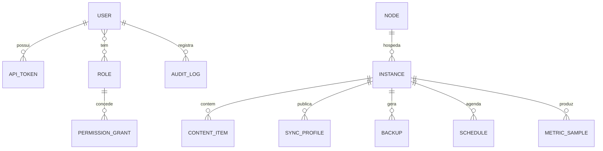

# 04 — Dados e API

## Modelo de banco de dados (núcleo, agnóstico de jogo)



| Tabela | Campos principais | Observações |
|---|---|---|
| `users` | id (uuid), username, email, password_hash (argon2), is_owner, created_at | Primeiro usuário criado no setup vira owner |
| `roles` / `role_permissions` / `user_roles` | — | Permissões string granulares: `instance.{id}.console.write`, `*` etc. |
| `api_tokens` | token_hash, user_id, scopes[], expires_at, last_used_at | Para CLI, mobile, integrações |
| `nodes` | id, name, token_hash, transport (embedded/ws), last_seen, os_info json | O node local é criado automaticamente |
| `instances` | id, node_id, provider_id, flavor, name, dir, state, ports json, java/runtime json, provider_data json, created_at | `provider_data` = extensão livre do Provider |
| `content_items` | id, instance_id, ctype, file, sha256, enabled, metadata json, updated_at | Cache do analisador; chave real é sha256 |
| `sync_profiles` | id, instance_id, name, rules json, manifest json, manifest_sig, published_at, channel (stable/beta) | O que o Launcher consome |
| `backups` | id, instance_id, path/storage_ref, size, sha256, trigger (manual/schedule), retention_class, created_at | Storage é uma porta (local hoje, S3 futuro) |
| `schedules` | id, instance_id?, cron, action json, enabled, last_run, next_run | Ações: restart, backup, command, script |
| `events` | id, topic, payload json, created_at | Ring buffer (retenção configurável) |
| `audit_log` | id, user_id, action, target, details json, ip, created_at | Imutável |
| `metric_samples` | node_id/instance_id, ts, kind, value | Downsampling automático (bruto 24 h → 5 min 30 d) |
| `settings` | key, value json, schema_version | Config do Core versionada — nunca mais JSON solto |

Migrações Alembic desde a primeira tabela. `schema_version` gravado; upgrade automático no boot com backup prévio do banco.

## API — princípios

- **Tudo em `/api/v1`**; breaking changes só em `/api/v2` (v1 mantida por período documentado).
- OpenAPI 3.1 gerado do código; o cliente TS do dashboard/launcher é **gerado** desse schema no CI — impossibilita drift de contrato.
- Autenticação: `Authorization: Bearer <JWT>` (sessões) ou `<token de API>`; refresh em `/auth/refresh`.
- Erros padronizados (RFC 9457 problem+json): `{type, title, status, detail, instance}`.
- Paginação por cursor (`?cursor=&limit=`), filtro e ordenação padronizados.
- Rate limit por token/IP com headers `X-RateLimit-*`.

## Superfície REST (v1 — resumo)

```
Auth        POST /auth/login | /auth/refresh | /auth/logout
            GET  /auth/me
Users/RBAC  CRUD /users, /roles;  POST /users/{id}/roles
Tokens      CRUD /tokens (escopos, expiração)
Nodes       GET /nodes;  POST /nodes (gera token de registro);  GET /nodes/{id}/metrics
Providers   GET /providers                        # descobertos via entry points
            GET /providers/{id}/flavors
Instances   CRUD /instances
            POST /instances/{id}/power            # start|stop|restart|kill
            GET  /instances/{id}/status
            POST /instances/{id}/command          # comando de console
            GET  /instances/{id}/logs?cursor=
Files       GET/PUT/DELETE /instances/{id}/files?path=   # sandbox no dir da instance
            POST /instances/{id}/files/op         # move/copy/mkdir/extract
Content     GET  /instances/{id}/content?type=mod
            POST /instances/{id}/content/{item}/toggle | DELETE …
            POST /instances/{id}/content/compare  # Cliente × Servidor generalizado
            GET  /content/search?source=modrinth&q=…      # busca federada
Config      GET  /instances/{id}/config-schema    # JSON Schema do Provider
            GET/PUT /instances/{id}/config
Sync        CRUD /instances/{id}/sync-profiles
            POST /instances/{id}/sync-profiles/{p}/publish
Público     GET  /public/servers/{slug}/status | /news | /sync-manifest   # Launcher, sem login
Backups     CRUD /instances/{id}/backups;  POST …/{b}/restore
Schedules   CRUD /schedules
Events      GET /events?topic=&cursor=
```

## WebSocket (`/ws`)

Um socket, múltiplos tópicos (subscribe/unsubscribe por mensagem):

| Tópico | Fluxo | Conteúdo |
|---|---|---|
| `instance.{id}.console` | ↔ | Linhas de console (parseadas pelo Provider: nível, jogador, evento) + envio de comandos |
| `instance.{id}.status` | → | Transições de estado (starting/online/stopping/crashed) |
| `node.{id}.metrics` | → | CPU/RAM/disco/rede (1 Hz, agregado) |
| `instance.{id}.metrics` | → | TPS/tick/jogadores (se o Provider expõe) |
| `events` | → | Espelho do barramento interno (filtrável) |
| `agent.{id}.ctrl` | ↔ | Canal privado Core↔Agent (registro, comandos, heartbeat) |

Mensagens: `{topic, type, payload, ts, seq}` — `seq` permite reconexão com replay curto.

## Fluxo crítico: sincronização do Launcher

1. Admin define `SyncRules` no Dashboard (ex.: "mods: espelhar exceto client-only; configs: só `defaultconfigs/`; shaders: opcional").
2. Core gera o **manifesto**: lista de `{path, sha256, size, action (require/optional/forbid), source (própria CDN local do Core | Modrinth | CurseForge)}` e assina com Ed25519.
3. Launcher baixa o manifesto (`/public/...`), verifica assinatura, calcula diff local (hashes em cache), monta plano (baixar X, remover Y, manter Z), executa em paralelo com retomada e valida SHA256 final.
4. Resultado reportado ao Core (telemetria opcional): admin vê quais jogadores estão sincronizados.

É o mesmo mecanismo para **reparar instalação** (diff completo) e **atualizar** (diff incremental) — um único código.
