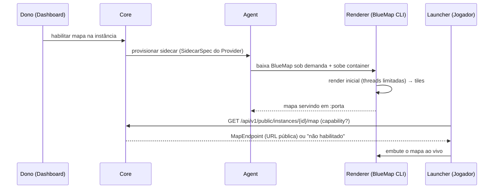

# ADR 0001 — Capability de Mapa do Mundo

- **Status:** Aceito (design) — implementação prevista para ~v0.7 (Mundos)
- **Data:** 2026-07-26
- **Contexto do produto:** o Launcher deixa de ser "só um launcher" e vira central do servidor para o jogador (ver protótipo de UI). Uma das telas propostas é **Mapa**: enxergar o mundo e as construções direto no launcher.

Este é o primeiro ADR do projeto. Ele também estabelece a convenção `docs/adr/NNNN-titulo.md`
que a doc [02 — Arquitetura](../02-arquitetura.md) já previa.

---

## Contexto

O jogador quer ver o mundo do servidor (spawn, bases, fazendas) sem entrar no jogo — o
mesmo valor que mods de mapa (JourneyMap, Xaero's) dão em cliente, e que mapas web
(Dynmap, BlueMap) dão em servidor.

Surgiram duas perguntas concretas do dono do produto:

1. Dá para puxar os dados de um mod de mapa que grava arquivos na pasta do jogo (ex.: o
   JourneyMap gera tiles PNG em `.minecraft/journeymap/data/...`)?
2. Se o mapa roda "em outra CLI" (processo separado), quando outra pessoa baixar o Aether
   para o próprio servidor, o mapa vai junto?

Este ADR responde às duas fechando a arquitetura da funcionalidade.

## Decisão

**Mapa é uma _capability opcional de Provider_, ligada por instância (opt-in), com a
renderização desacoplada do processo do jogo.** Segue exatamente o princípio já firmado no
contrato: *"tudo opcional degrada graciosamente"* — um Provider sem mapa simplesmente não
mostra a seção; um servidor que não ligou o mapa não paga custo algum.

Duas fontes de dados, com preferência clara:

| Fonte | Onde renderiza | Cobertura | Dependência | Papel |
|---|---|---|---|---|
| **Servidor (BlueMap)** | sidecar desacoplado, lê o save | mundo inteiro, igual para todos, ao vivo | mod/binário no servidor (baixado sob demanda) | **preferencial** |
| **Cliente (JourneyMap)** | launcher lê os tiles/waypoints locais | só o que aquele jogador explorou (fog of war) | mod no cliente | **fallback** |

O launcher escolhe automaticamente: se a instância declara mapa de servidor, embute o mapa
ao vivo; senão, oferece ler o JourneyMap local.

### Por que BlueMap e não Dynmap

- **BlueMap tem modo standalone (CLI):** renderiza lendo os arquivos do mundo **fora do
  processo do jogo**. Isso permite rodar como _sidecar_ (container/processo separado, com
  CPU limitada, em horário ocioso) — o servidor de jogo não paga o custo do render.
- **Dynmap é plugin acoplado** ao processo e historicamente pesa mais no thread principal.
  Sem desacoplamento, fere o objetivo de não impactar o TPS.
- BlueMap tem versões Forge/Fabric/Spigot/Paper — cobre o alvo atual (Forge 1.20.1) e os
  flavors do roadmap.

> Dynmap **não** está descartado como Provider alternativo no futuro (ex.: servidores onde
> BlueMap não se aplique); a capability é abstrata o bastante para aceitá-lo. Mas o caminho
> padrão e recomendado é BlueMap.

## Contrato (adição ao SDK de Provider)

Mais uma capability opcional, no mesmo estilo de `metrics_extractor(self) -> ... | None`.
Assinaturas ilustrativas — o código real nasce junto com a implementação:

```python
class GameProvider(Protocol):
    ...
    # Opcional — ausência = sem seção de mapa
    def map_source(self, instance) -> MapSource | None: ...


class MapSource(Protocol):
    kind: Literal["server_http", "client_tiles"]

    # kind == "server_http" (BlueMap/Dynmap): como o Core/Agent provisiona o renderer
    def sidecar_spec(self, instance) -> SidecarSpec | None:
        """Imagem/comando, mounts (save read-only, dir de saída), porta, limites de CPU."""

    def web_endpoint(self, instance) -> MapEndpoint | None:
        """URL (interna) do mapa renderizado que o Core expõe publicamente ao launcher."""

    # kind == "client_tiles" (JourneyMap): como o launcher lê os dados locais
    def client_layout(self) -> ClientMapLayout | None:
        """Caminhos relativos na pasta do jogo (tiles por dimensão, waypoints) e formato."""
```

Princípios preservados:

- **Schemas/dados, não telas:** o Provider descreve *como* obter o mapa; o launcher tem um
  renderizador genérico (embute a URL web, ou monta os tiles do cliente). O Provider nunca
  envia HTML — mesma regra do `ConfigSchema`.
- **Agnóstico de jogo:** `MapSource` não fala "Minecraft". Qualquer jogo com mapa de mundo
  (um `server_http` de um painel próprio, tiles de outro formato) declara a mesma capability.
  Mantém o "nunca só Minecraft".
- **Versionado pelo `sdk_version`** como o resto do contrato.

## Fluxo (server_http / BlueMap)



## Distribuição — respondendo à pergunta 2

**A capacidade viaja com o projeto; o binário, não.**

- O *código de orquestração* do mapa (o `MapSource` do Provider, o `SidecarSpec`) é
  versionado no repo, dentro de `providers/minecraft/`. Quem baixa o Aether recebe a
  capability embutida — comportamento idêntico em qualquer instalação.
- O **BlueMap em si (`.jar`/imagem) é baixado sob demanda** quando o dono liga o mapa —
  exatamente como o launcher já baixa Java (Adoptium) e Forge, e como a doc 02 exige
  ("o launcher **nunca redistribui** binários"). Repo continua leve; nada de software de
  terceiros comitado.
- **Opt-in por instância:** mapa nasce **desligado**. Sem custo até alguém ligar.

## Custo no servidor (postura honesta)

| Recurso | Custo | Observação |
|---|---|---|
| **CPU** | alto no **render inicial**, baixo depois | BlueMap usa threads configuráveis; sidecar isola do jogo. Depois só re-renderiza chunks alterados. |
| **RAM** | +~0,5–2 GB durante render | modesto; no sidecar, não rouba da JVM do jogo. |
| **Disco** | GB em mundos grandes | os tiles do mapa; é o "peso" mais silencioso. |
| **Banda** | desprezível para servidor de amigos | escala com nº de visualizadores simultâneos. |

Mitigações já previstas: render em sidecar com **limite de CPU**, execução **fora de
horário de pico** (via Scheduler, v0.5), e re-render incremental.

Ressalva de modpack: blocos de mods sem extensão de textura podem aparecer genéricos no
BlueMap; vanilla e mods populares ficam corretos.

## Alternativas consideradas

- **Só JourneyMap (cliente):** rejeitado como padrão — fog of war por jogador, exige o mod
  em cada cliente. Mantido como **fallback**.
- **Dynmap acoplado ao processo:** rejeitado como padrão — pesa no TPS, não desacopla.
- **Renderer próprio do Aether:** rejeitado — reinventar BlueMap sem ganho.

## Consequências

- Entra no roadmap junto de **v0.7 (Mundos)** — é visualização de mundo, casa com o
  gerenciador de mundos e o backup/troca de saves.
- Precisa de um gancho de **sidecar/processo auxiliar** no Agent (start/stop/limites) — já
  alinhado com o supervisor de processos da v0.2 e o suporte Docker da v0.6.
- Requer um endpoint público capability-gated no Core (`.../map`) e uma seção **Mapa** no
  launcher que só aparece quando a capability existe.

## Plano de teste (na implementação, não agora)

Validar antes de congelar o contrato, no servidor real (Forge 1.20.1), **com o dono
acompanhando** (mexe em produção):

1. Rodar BlueMap CLI standalone contra uma cópia do save; medir tempo/CPU/RAM do render
   inicial e o tamanho em disco.
2. Servir os tiles e validar o embed no launcher.
3. Medir o custo do re-render incremental após jogar um pouco.
4. Conferir a aparência dos blocos do modpack atual.

Só depois desse teste o formato do `MapSource`/`SidecarSpec` é dado como estável.
